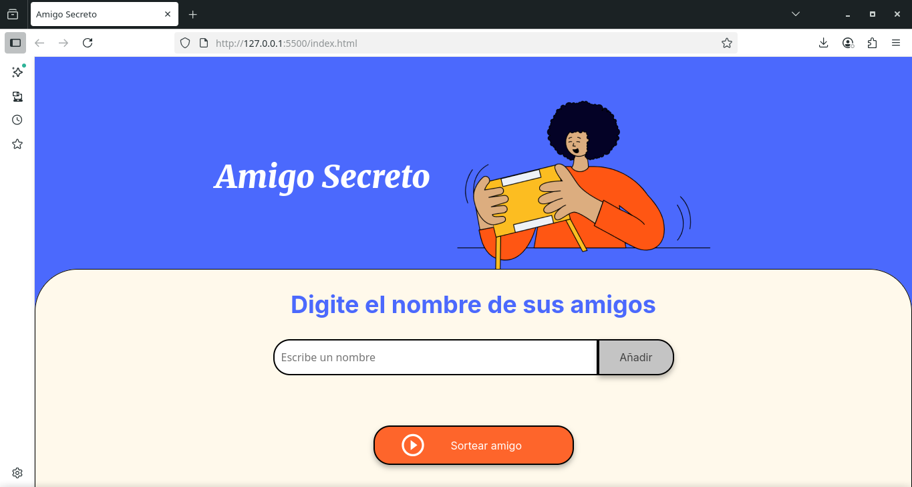
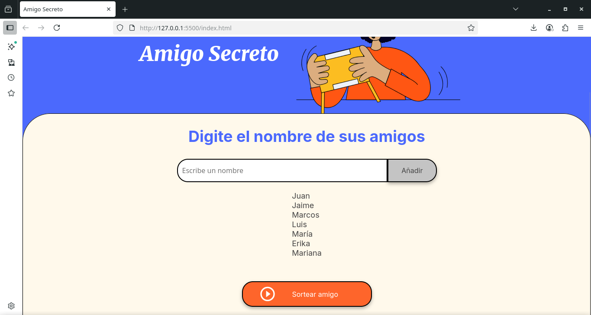
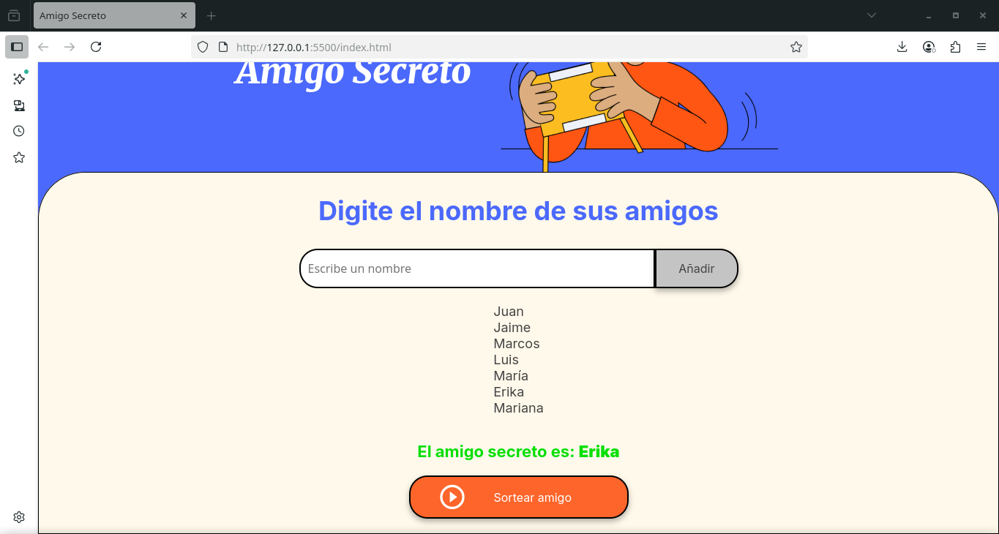

# 🎁 Amigo Secreto

Este proyecto es un reto del programa **Oracle Next Education (ONE)** cuyo objetivo principal es **fortalecer las habilidades en lógica de programación** mediante el desarrollo de una aplicación web interactiva.

La aplicación permite a los usuarios ingresar nombres de amigos en una lista y realizar un sorteo aleatorio para determinar quién es el **amigo secreto**.

---

## 🚀 Funcionalidades

**Agregar nombres**: los usuarios pueden escribir un nombre en el campo de texto y añadirlo a la lista.  
**Validación de datos**: no se permiten cadenas vacías ni solo espacios.  
**Visualización en lista**: todos los nombres añadidos se muestran en una lista interactiva.  
**Sorteo aleatorio**: al presionar el botón *Sortear Amigo*, se selecciona y muestra un nombre al azar.  
**Interfaz responsive**: el diseño se adapta a diferentes dispositivos gracias a HTML5 y CSS3.  

---

## 🖼️ Vista previa

### 📌 Pantalla principal


### 📌 Nombres añadidos


### 📌 Resultado del sorteo


---

## 🛠️ Tecnologías utilizadas

- **HTML5** → estructura de la página  
- **CSS3** → estilos y diseño responsive  
- **JavaScript (app.js)** → lógica de programación y manipulación del DOM  

---

## 📂 Estructura del proyecto

```bash
AmigoSecreto/
│── index.html        # Página principal
│── style.css         # Estilos de la aplicación
│── app.js            # Lógica en JavaScript
└── assets/           # Imágenes, íconos y capturas
